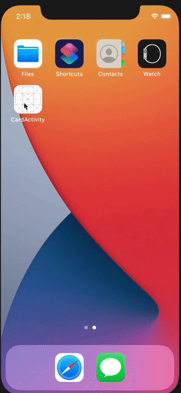

## Table of contents
* [General info](#general-info)
* [Technologies](#technologies)
* [Setup](#setup)

## General info
This project is as a template of architecture for SwiftUI project. It used MVVM as base architecture and use Combine as the network service.
The feature of this project is only getting list of friends data which is received from local API (Mockoon) then navigating to detail screen. It involved MVVM architecture and utilize the Combine

    
## Technologies
Project is created with:
* SwiftUI
* Swift 5.0
* Combine
* Mockoon (as local API)
* MVVM Architecture
    
## Setup
To run this project:
* Please just clone the project and involve Mockoon as local API. You can learn on how to use Mockoon further at this link [How to use Mockoon](https://tio-satrio-wicaksono.medium.com/implement-api-in-ios-developing-with-mockoon-before-the-real-api-is-ready-fd809aa02439).
* [Mockoon Sample Response](CardActivityMockoon.json) is sample mock that i used as response API then import to your Mockoon app.

